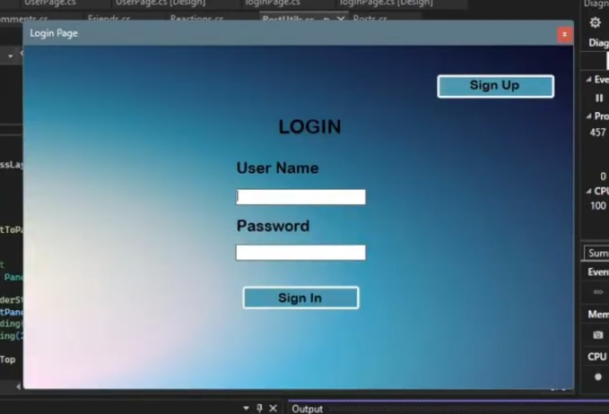

# 🚀 Social Media App (OOP + SQL Server)

[](https://dotnet.microsoft.com/)
[](https://www.microsoft.com/sql-server)

## 🔥 Features
✔ User login/authentication  
✔ Create/view posts  
✔ Comment on posts  
✔ React to posts (Like/Love/etc)  
✔ Real-time UI updates  

## ⚙️ Tech Stack
- **Frontend**: Windows Forms
- **Backend**: C# (.NET 6)
- **Database**: SQL Server 2022
- **Architecture**: 3-Layer (UI → Business Logic → Data Access)

## 🗃️ Database Tables
```sql
-- Main Tables
CREATE TABLE Users (
    UserID INT PRIMARY KEY,
    Username VARCHAR(50),
    Password VARCHAR(100)
);

CREATE TABLE Posts (
    PostID INT PRIMARY KEY,
    UserID INT FOREIGN KEY REFERENCES Users(UserID),
    Content TEXT
);
```
## 🎥 Demo Video
[](https://drive.google.com/file/d/1rAAQXLDnvnBILuG0ACuZ9IqBlzixYwlc/view)

**Video Content:**
- Before 4:23: Code walkthrough (OOP/SQL implementation)
- After 4:23: Live app demonstration with voice explanation

[Watch Now](https://drive.google.com/file/d/1rAAQXLDnvnBILuG0ACuZ9IqBlzixYwlc/view) | [Jump to Demo (4:23)](https://drive.google.com/file/d/1rAAQXLDnvnBILuG0ACuZ9IqBlzixYwlc/view?t=263s)

